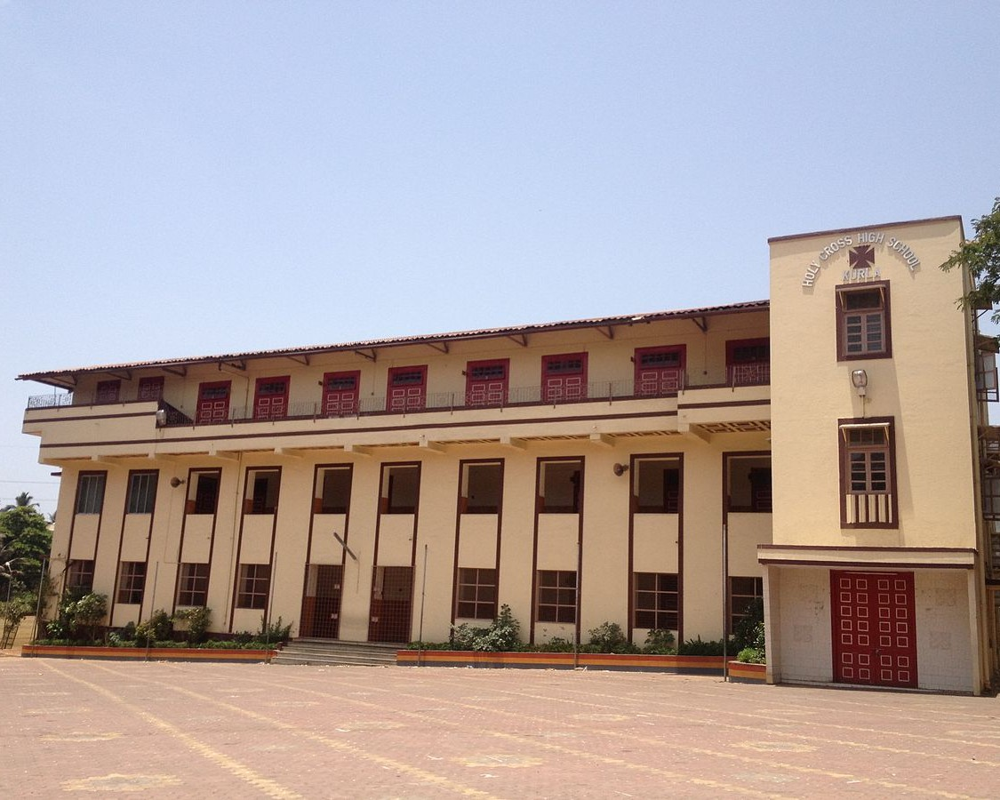

# Gurukul Vidyalay & Jr. College (GVSJC) Portal



A modern, responsive, and SEO-optimized school management system and informational portal built for **Gurukul Vidyalay & Jr. College, Chokak, Kolhapur**. Built using a modern web development stack, the platform provides a public-facing informational website, a comprehensive **Admin Dashboard**, and a dedicated **Clerk Portal** for daily school operations.

---

## 🚀 Tech Stack

- **Frontend Framework:** React 18 with Vite
- **Language:** TypeScript
- **Styling:** Tailwind CSS (configured with an elegant off-white theme)
- **Component Library:** Custom components inspired by Shadcn UI
- **Routing:** React Router v6
- **State & Data Fetching:** TanStack React Query v5
- **Backend & Database:** Supabase (PostgreSQL, Storage, Auth)
- **SEO Elements:** React Helmet Async, JSON-LD Schema.org, Open Graph, Twitter Cards
- **Icons:** Lucide React

---

## ✨ Key Features

### 🌐 Public Portal
- **Informational Pages:** Home, About, Academics, Admissions, Contact, Faculty, Gallery, and Toppers.
- **Dynamic Content:** Home page features an auto-sliding hero image carousel and live Notice Board.
- **Responsive Design:** Fully responsive, mobile-first design with smooth scroll-reveal animations.
- **Multilingual Support:** Built-in translation structure via a custom Language Context.
- **SEO Optimized:** Exceptional SEO setup with per-page `react-helmet-async` tags, `sitemap.xml`, and structured data.
- **Online Forms:** Public Contact and Admission forms connected directly to Supabase.

### 🛡️ Admin Dashboard (`/admin`)
- **Protected Routes:** Secure access to administrative functions.
- **Content Management:** Update hero text, site content, and school information dynamically.
- **User & Data Management:** 
  - View live Site Queries and Admission applications.
  - Manage Students, Faculty profiles, and Academic Toppers.
  - Manage Notice Board announcements.
  - Gallery Manager with Supabase Storage integration for uploading photos/videos.

### 📋 Clerk Operations Portal (`/clerk`)
- **Student Management:** View and manage enrolled students with robust filtering and search.
- **Fee Collection & Tracking:** Manage fee payments, generate receipts, and track paid/unpaid/partial fee statuses with visual progress bars.
- **Document Generation:** Automatically generate and print:
  - Student ID Cards (customizable with photos and school branding).
  - Bonafide Certificates.
  - Leaving Certificates.
  - Custom Report Cards.
- **Examinations Module:** Create exams, define subjects and max marks, enter student marks in bulk, and generate printable report cards.

---

## 🛠️ Project Structure

```text
GVSJC/
├── public/                 # Static assets
│   ├── images/             # Organized image assets (campus, events, staff, etc.)
│   ├── icon.png            # Favicon
│   ├── robots.txt          # SEO rules
│   └── sitemap.xml         # SEO sitemap
├── supabase/               # Supabase Database Configuration
│   ├── migrations/         # Table schemas (exams, gallery, faculty, etc.)
│   ├── policies/           # Row Level Security (RLS) policies
│   ├── seeds/              # Dummy data generation scripts
│   └── storage/            # Storage bucket configurations
├── src/
│   ├── components/         # Reusable UI components (Layouts, UI elements)
│   ├── constants/          # Centralized constants (classes, academic years, etc.)
│   ├── contexts/           # React Contexts (Language, Auth)
│   ├── hooks/              # Custom React Hooks (Supabase queries, UX hooks)
│   ├── lib/                # Library configurations (Supabase client, utils)
│   ├── pages/              # Route views
│   │   ├── admin/          # Admin dashboard components
│   │   ├── clerk/          # Clerk dashboard components
│   │   ├── shared/         # Components shared between roles (e.g., FeePayments)
│   │   └── ...             # Public pages (Index, About, etc.)
│   ├── types/              # TypeScript interfaces (Student, Exam, Gallery, etc.)
│   ├── App.tsx             # Main App component & Router setup
│   ├── index.css           # Global Tailwind & Custom CSS variables
│   └── main.tsx            # React Entry point
├── tailwind.config.ts      # Tailwind CSS configuration
├── tsconfig.json           # TypeScript configuration
└── vite.config.ts          # Vite configuration
```

---

## ⚙️ Getting Started

### 1. Prerequisites
Ensure you have the following installed on your local machine:
- [Node.js](https://nodejs.org/) (Version 18+ recommended)
- `npm` or `yarn`

### 2. Required Environment Variables
Create a `.env` or `.env.local` file in the root directory. You will need your Supabase project credentials:

```env
VITE_SUPABASE_URL=your_supabase_project_url
VITE_SUPABASE_ANON_KEY=your_supabase_anon_key
```

### 3. Database Setup (Supabase)
To set up the database, execute the SQL files found in the `supabase/migrations/`, `supabase/policies/`, and `supabase/storage/` directories in your Supabase SQL Editor. If you need test data, run the scripts in `supabase/seeds/`.

### 4. Installation
Clone the repository and install dependencies:

```bash
git clone https://github.com/your-username/GVSJC.git
cd GVSJC
npm install
```

### 5. Running the Development Server

```bash
npm run dev
```

Open your browser and navigate to `http://localhost:8080/` (or the port specified by Vite).

### 6. Building for Production

To create an optimized production build:

```bash
npm run build
```

This will run TypeScript checks, bundle the app into the `dist/` directory, and apply minification. You can preview the built app using:

```bash
npm run preview
```

---

## 🗄️ Database Schema 

The application utilizes the following primary Supabase tables:

- **`contacts`**: Visitor queries from the Contact Us page.
- **`admission`**: Student applications from the Admissions page.
- **`students`**: Enrolled student records.
- **`fees`**: Records of fee payments.
- **`exams` & `exam_marks`**: Exam configurations and student grades using `JSONB` for dynamic subjects.
- **`gallery`**: Photo and video links pointing to Supabase Storage.
- **`faculty` & `toppers`**: Information for the public Faculty and Toppers pages.
- **`notices`**: Live announcements for the Notice Board.

*(Note: Ensure Supabase RLS (Row Level Security) policies are properly set according to the provided policy scripts to protect data access.)*

---

## 👨‍💻 Maintainers

Developed & Designed for **Gurukul Vidyalay & Jr. College**.
